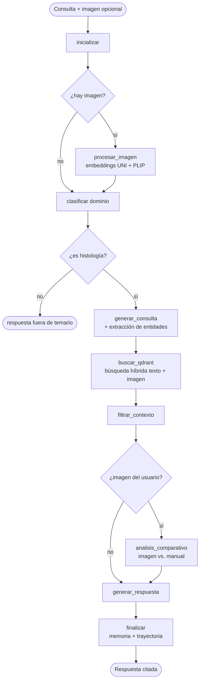

<p align="center">
  
</p>

<h1 align="center">RAG Histología</h1>

<p align="center">
  Asistente conversacional <strong>multimodal</strong> para el estudio de histología médica:
  responde preguntas y analiza imágenes de preparaciones al microscopio,
  <strong>fundamentando cada respuesta en el manual de la cátedra</strong>.
</p>

<p align="center">
  
  
  
  
  
  
</p>

> **TL;DR** — Un estudiante sube una foto de una preparación histológica y pregunta "¿qué tejido es este?".
> El sistema entiende la imagen con modelos de visión específicos de patología (UNI/PLIP), busca en el
> manual con Qdrant (texto + imagen), razona el flujo con un agente de estados (LangGraph) y responde
> **citando la fuente**. No es un wrapper de un chatbot: incluye recuperación híbrida, memoria por sesión
> y un pipeline de evaluación cuantitativa.

<!-- 📸 Agregá una captura o GIF de la interfaz acá para que se vea de un vistazo:
<p align="center"></p>
-->

---

## Tabla de contenidos

- [Tabla de contenidos](#tabla-de-contenidos)
- [Contexto](#contexto)
- [Características](#características)
- [Arquitectura](#arquitectura)
- [Inicio rápido](#inicio-rápido)
- [Requisitos previos](#requisitos-previos)
- [Configuración](#configuración)
- [Agregar PDFs](#agregar-pdfs)
- [Ejecutar manualmente](#ejecutar-manualmente)
- [Cómo funciona](#cómo-funciona)
- [Estructura del proyecto](#estructura-del-proyecto)
- [Evaluación](#evaluación)
- [Documentación y recursos](#documentación-y-recursos)
- [Troubleshooting](#troubleshooting)
- [Licencia](#licencia)

---

## Contexto

Proyecto desarrollado en el **CETEC** de la **Facultad de Ingeniería de la Universidad de Buenos Aires (FIUBA)**.

| | |
|---|---|
| **Dirección del proyecto** | Diego Racero |
| **Equipo (Grupo 2)** | Mateo Gonzalez Pautaso · Alén Calandria |
| **Período** | 9 de febrero – 29 de junio de 2026 |

**Stack:** FastAPI · LangGraph · Qdrant · Groq (Llama-4-Scout) · MiniLM · UNI/PLIP · frontend web

---

## Características

- 🗣️ **Preguntas en lenguaje natural** sobre el manual, con respuestas **citadas** y trazables a la fuente.
- 🖼️ **Multimodal**: subí una imagen histológica y preguntá sobre ella; el sistema la analiza con modelos de visión de patología.
- 🔬 **Análisis comparativo imagen→imagen**: compara la imagen del usuario contra las imágenes de referencia del manual.
- 🔎 **Búsqueda híbrida**: combina similitud semántica de texto, entidades (tejidos/tinciones/células), keywords y embeddings visuales.
- 🧭 **Clasificador de dominio**: descarta consultas que no son de histología antes de gastar recuperación/LLM.
- 🧠 **Memoria por sesión**: recuerda el historial y la imagen activa entre turnos, aislada por usuario.
- 📊 **Evaluación cuantitativa**: pipeline con RAGAS (recall@k, fidelidad) + smoke tests de confiabilidad.
- 💻 **Local-first**: Qdrant embebido por defecto (sin servicios externos), con opción de Qdrant Cloud.

---

## Arquitectura

Cada consulta se procesa como un **grafo de estados** orquestado con LangGraph. Los nodos comparten un
estado común (`AgentState`) y el flujo se ramifica según haya o no imagen y según el dominio de la pregunta:



**Componentes principales:**

| Componente | Rol |
|---|---|
| **LangGraph** (`assistant.py`) | Orquesta el pipeline como agente de estados |
| **Qdrant** (`qdrant_store.py`) | Base vectorial con vectores nombrados (texto / UNI / PLIP) |
| **UNI + PLIP** (`embeddings.py`) | *Foundation models* de patología para embeddings de imagen |
| **MiniLM** | Embeddings de texto (`all-MiniLM-L6-v2`) |
| **Llama-4-Scout** vía Groq (`llm.py`) | LLM generador, con reintentos y manejo de cuota |
| **Clasificador** (`classifier.py`) | Filtro de dominio (similitud semántica + árbitro LLM) |
| **Memoria** (`memory.py`) | Historial + imagen activa, por sesión |
| **Extractores** (`extractors.py`) | PDF → texto/imágenes/temario + entidades |

---

## Inicio rápido

```bash
# 0. Clonar el repositorio
git clone https://github.com/MateoGonzalezPautaso/cetec-rag-histologia.git
cd cetec-rag-histologia

# 1. Copiar y completar el archivo de configuración
cp .env.example app/.env
# Editar app/.env con tus claves (ver sección Configuración)

# 2. Verificar que estén los PDFs del manual
# El repo ya incluye PDFs en data/pdf/. También se pueden poner PDFs propios en app/pdf/.

# 3. Ejecutar el script de inicio
cd app && ./start.sh
```

El script instala dependencias, crea/usa una base Qdrant local en `app/qdrant_data/`, inicia el servidor y abre el navegador automáticamente en `http://localhost:10007`.

La primera vez también crea un acceso directo **«RAG Histología»** en el escritorio. Al hacer doble clic: si el servidor ya está corriendo abre el navegador; si no, lo inicia (vía `launch.sh`) y abre el navegador cuando está listo.

---

## Requisitos previos

| Herramienta | Para qué | Cómo instalar |
|---|---|---|
| Python 3.10+ | Ejecutar el backend | `python3 --version` |
| [uv](https://docs.astral.sh/uv/) | Gestor de paquetes Python | `curl -LsSf https://astral.sh/uv/install.sh \| sh` |
| Tesseract OCR | Extraer texto de imágenes en PDFs | `sudo apt install tesseract-ocr tesseract-ocr-spa` |
| Poppler | Renderizar PDFs como imágenes | `sudo apt install poppler-utils` |

---

## Configuración

Copiar `.env.example` a `app/.env` y completar las claves:

```bash
cp .env.example app/.env
```

| Variable | Requerida | Descripción | Dónde obtenerla |
|---|---|---|---|
| `GROQ_API_KEY` | ✅ | LLM principal (Llama-4-Scout) | https://console.groq.com/keys |
| `HF_TOKEN` | ✅ | Descarga modelos UNI y PLIP — requiere aceptar los términos del modelo | https://huggingface.co/settings/tokens |
| `QDRANT_PATH` | ❌ | Carpeta local persistente de Qdrant. Por defecto: `./qdrant_data` | No aplica |
| `QDRANT_URL` | ❌ | URL de Qdrant remoto si se quiere usar Cloud en lugar de local | https://cloud.qdrant.io/ |
| `QDRANT_KEY` | ❌ | API key para Qdrant remoto | https://cloud.qdrant.io/ |
| `LANGSMITH_API_KEY` | ❌ | Trazabilidad del pipeline. El sistema funciona sin esto | https://smith.langchain.com/ |
| `ALLOWED_ORIGINS` | ❌ | Orígenes CORS permitidos (lista separada por comas, o `*`). Por defecto solo `localhost`/`127.0.0.1` | No aplica |
| `MAX_IMAGE_MB` | ❌ | Tamaño máximo (MB) de imágenes subidas por el chat. Por defecto: `8` | No aplica |

---

## Agregar PDFs

El servidor usa los PDFs versionados en `data/pdf/`. Si se agregan PDFs en `app/pdf/`, esos tienen prioridad. Al iniciar, el servidor:

1. Lee el texto de los PDFs y lo divide en chunks.
2. Extrae las imágenes de cada página.
3. Genera embeddings de texto (MiniLM), visuales (UNI, PLIP) e indexa todo en Qdrant local.
4. Extrae el temario automáticamente del contenido.

El indexado se saltea solo si las colecciones de Qdrant ya están pobladas **y** existe la marca de indexación completa (`app/.qdrant_index_complete`). Si una indexación previa quedó incompleta —por una interrupción o porque algún ítem falló al indexarse— la marca no se escribe y el sistema reindexa automáticamente en el próximo arranque (los upserts son idempotentes). Para forzar una reindexación manual: borrar `app/.qdrant_index_complete` y, si se quiere empezar desde cero, borrar también `app/qdrant_data/`.

---

## Ejecutar manualmente

```bash
cd app

# Instalar dependencias
uv sync

# Modo desarrollo (recarga automática)
uv run uvicorn server:app --reload --host 0.0.0.0 --port 10007

# Modo producción
uv run python server.py
```

El servidor tarda ~1-3 minutos en arrancar la primera vez porque carga los modelos de visión (UNI, PLIP) desde HuggingFace.

Verificar que esté listo:
```bash
curl http://localhost:10007/api/status
# → {"ready": true, ...}
```

---

## Cómo funciona

Cada consulta pasa por un grafo de nodos LangGraph (ver [Arquitectura](#arquitectura)):

1. **inicializar** — carga estado y memoria conversacional.
2. **procesar_imagen** — si hay imagen nueva, genera embeddings UNI y PLIP; si no hay imagen nueva pero había una en el turno anterior, la reutiliza.
3. **clasificar** — verifica que la consulta sea sobre histología usando similitud semántica y, si está cerca del umbral, un árbitro LLM.
4. **generar_consulta** — reformula la pregunta para mejorar el retrieval, extrae entidades (tejidos, tinciones, células, etc.).
5. **buscar_qdrant** — búsqueda híbrida: texto semántico + entidades + keyword + captions de imagen + embeddings visuales.
6. **filtrar_contexto** — descarta resultados por debajo del umbral de similitud y limita a 6 bloques de contexto.
7. **analisis_comparativo** — si hay imagen del usuario, la compara contra imágenes del manual.
8. **generar_respuesta** — sintetiza la respuesta con el LLM usando el contexto recuperado.
9. **finalizar** — guarda trayectoria, actualiza memoria semántica.

---

## Estructura del proyecto

```
.
├── app/                       # Aplicación (backend + frontend)
│   ├── server.py              # FastAPI: endpoints REST + sirviendo el frontend
│   ├── pyproject.toml         # Dependencias Python (gestor: uv)
│   ├── start.sh               # Script de inicio con checks automáticos + acceso directo
│   ├── launch.sh              # Lanzador del acceso directo del escritorio
│   ├── .env                   # Claves privadas (no commitear)
│   │
│   ├── src/                   # Módulos del backend
│   │   ├── assistant.py       # Orquestador principal: grafo LangGraph + todos los nodos
│   │   ├── graph.py           # AgentState: estado compartido entre nodos
│   │   ├── config.py          # Constantes, rutas, anclas semánticas, reglas de entidades
│   │   ├── llm.py             # Wrappers de LLM con reintentos y manejo de cuota
│   │   ├── embeddings.py      # Wrappers PLIP y UNI para embeddings de imagen
│   │   ├── qdrant_store.py    # Cliente Qdrant: esquema, upsert y búsqueda híbrida
│   │   ├── memory.py          # Memoria semántica: historial + imagen activa por sesión
│   │   ├── classifier.py      # Clasificador de dominio histológico (embeddings + LLM)
│   │   └── extractors.py      # Extractor de imágenes PDF, temario y entidades
│   │
│   ├── client/                # Frontend web (HTML + JS + CSS, sin frameworks)
│   │   ├── index.html
│   │   ├── app.js
│   │   └── style.css
│   │
│   ├── evaluar_ragas.py       # Evaluación RAGAS del pipeline
│   ├── eval_reliability.py    # Smoke test de confiabilidad
│   └── eval_set_basico.json   # Conjunto de preguntas de evaluación
│
├── data/pdf/                  # Manuales en PDF versionados
├── docs/                      # Informes por sprint, logs de tuning y resultados de evaluación
├── notebooks/                 # Notebooks de exploración y evaluación de chunk size
└── README.md
```

> Carpetas generadas automáticamente en runtime (no versionadas): `app/imagenes_extraidas/`
> (imágenes extraídas de los PDFs), `app/imagenes_chat/` (imágenes subidas por usuarios) y
> `app/qdrant_data/` (base Qdrant local persistente).

---

## Evaluación

Todos los comandos se ejecutan desde dentro de `app/`:

```bash
cd app

# Smoke test (rápido, no requiere LLM juez)
uv run python eval_reliability.py --base-url http://localhost:10007 \
  --set eval_set_basico.json --output eval_reliability_report.json

# Retrieval sin RAGAS (sin costo de LLM juez)
uv run python evaluar_ragas.py --no-ragas

# RAGAS completo (requiere OPENAI_API_KEY como juez, puede tardar ~1h)
RAGAS_MAX_WORKERS=2 uv run python evaluar_ragas.py --solo-ragas --limit 12

# Evaluación focalizada en preguntas específicas
uv run python evaluar_ragas.py --no-ragas --indices 1,5,9
```

No ejecutar RAGAS y el frontend en paralelo — compiten por cuota de modelos.

---

## Documentación y recursos

Material complementario para entender el diseño, las decisiones y los resultados del proyecto:

| Recurso | Descripción |
|---|---|
| [Informe Técnico — Sprint 1](docs/Sprint%201/Informe_Tecnico_Sprint1_Grupo2.pdf) | Informe del primer sprint (objetivos, diseño inicial, resultados). |
| [Informe Técnico — Sprint 2](docs/Sprint%202/Informe_Tecnico_Sprint2_Grupo2.pdf) | Informe del segundo sprint (multimodalidad, mejoras y evaluación). |
| [`docs/retrieval_tuning_log.md`](docs/retrieval_tuning_log.md) | Bitácora de ajustes de recuperación para reducir ruido entre fuentes manteniendo recall. |
| [`docs/vuelta_original_vs_actual.md`](docs/vuelta_original_vs_actual.md) | Comparativa entre la versión original y la actual del pipeline. |
| [`docs/Sprint 2/reporte_diagnostico_imagenes.json`](docs/Sprint%202/reporte_diagnostico_imagenes.json) | Diagnóstico de la recuperación imagen→imagen. |
| [`docs/Sprint 2/resultados_chunk_eval.json`](docs/Sprint%202/resultados_chunk_eval.json) | Resultados de la evaluación de tamaño de chunk. |
| [`notebooks/`](notebooks/) | Notebooks de exploración y evaluación de *chunk size* (v3.2 y v4.2). |

---

## Troubleshooting

**El servidor no arranca / error al cargar modelos**
- Verificar que `HF_TOKEN` esté en `.env` y que hayas aceptado los términos de UNI en HuggingFace.
- Si no hay GPU compatible, el sistema usa CPU automáticamente (más lento).

**Qdrant no conecta**
- Por defecto no se necesita Qdrant Cloud: se usa `app/qdrant_data/`.
- Verificar permisos de escritura en la carpeta `app/`.
- Si se configuró `QDRANT_URL`, verificar también `QDRANT_URL` y `QDRANT_KEY` en `.env`.

**El LLM responde "sin cuota"**
- La cuota de Groq se resetea diariamente. Esperar o cambiar `GROQ_API_KEY`.
- El sistema bloquea automáticamente nuevas llamadas por 5 minutos tras detectar cuota agotada (configurable con `LLM_QUOTA_BLOCK_SECONDS`).

**No aparecen imágenes del manual**
- Verificar que los PDFs estén en `data/pdf/` o `app/pdf/` y que Qdrant tenga datos (`/api/status` muestra `n_temas > 0`).
- Tesseract y Poppler deben estar instalados para la extracción.

---

## Licencia

Distribuido bajo licencia **MIT**. Ver [`LICENSE`](LICENSE) para más detalles.
